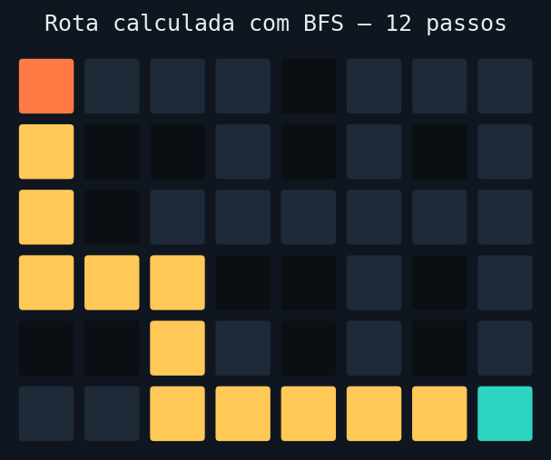

# 🗺️ Delivery Zone Mapper


Cálculo de zonas de entrega navegáveis e da rota mais curta entre um
restaurante e um cliente, num mapa simplificado de cidade — usando **DFS**
para mapear zonas e **BFS** para encontrar o caminho mais curto.

Este projeto nasceu como evolução de um desafio anterior, **Bitmap Holes**
(contagem de regiões conectadas numa matriz binária via DFS). Aqui, cada
região conectada de células livres passa a representar uma **zona de
entrega**, e o projeto evolui para resolver um problema real de logística
espacial: existe uma rota entre restaurante e cliente e, se existir, qual é
a mais curta?



## ✨ Funcionalidades

- Contagem de zonas navegáveis num mapa binário (`bitmap_holes.py`)
- Rotulagem de zonas conectadas para checagens de conectividade em O(1) (`label_zones`)
- Busca do caminho mais curto (BFS) entre dois pontos do mapa (`pathfinder.py`)
- Orquestração de ponta a ponta: zona + rota (`delivery.py`)
- CLI para gerar mapas aleatórios e visualizar a rota no terminal (`cli.py`)
- Visualização web interativa em HTML/CSS/JS puro (`frontend/`)
- Suíte de testes automatizados com `pytest` + CI no GitHub Actions

## 📦 Estrutura do projeto

```
delivery-zone-mapper/
├── src/delivery_zone_mapper/
│   ├── bitmap_holes.py   # DFS: contagem e rotulagem de zonas
│   ├── grid.py            # abstração CityMap
│   ├── pathfinder.py      # BFS: caminho mais curto
│   ├── delivery.py        # orquestração (zonas + BFS)
│   └── cli.py               # interface de linha de comando
├── tests/                   # testes automatizados (pytest)
├── examples/                 # scripts de exemplo
├── frontend/                  # visualização web (HTML/CSS/JS)
└── assets/                     # imagens geradas para este README
```

## ▶️ Como rodar

```bash
git clone https://github.com/SEU-USUARIO/delivery-zone-mapper.git
cd delivery-zone-mapper

pip install -e .                       # instala o pacote
pip install -r requirements-dev.txt    # pytest + matplotlib (dev only)

python examples/example_run.py                                     # exemplo ponta a ponta
python -m delivery_zone_mapper.cli --rows 10 --cols 20 --seed 42   # CLI com mapa aleatório
pytest -v                                                            # roda os testes
```

Para a visualização web, basta abrir `frontend/index.html` em qualquer
navegador — não depende de servidor nem do Python (o algoritmo foi
reescrito em JavaScript puro só para essa demo).

## 🧠 Decisões de Arquitetura

**DFS iterativa (com pilha explícita) em vez de recursiva, no `bitmap_holes.py`.**
Uma DFS recursiva usaria a pilha de chamadas do próprio Python, que tem um
limite padrão de 1000 níveis (`sys.getrecursionlimit()`). Um mapa de cidade
real (por exemplo 200x200 células) estouraria esse limite com facilidade
numa zona grande e serpenteada. Uma pilha manual (`list` usada como stack)
resolve a busca sem depender da profundidade de recursão.

**BFS, e não DFS, para o caminho mais curto.**
O mapa é um grafo não-ponderado — mover para qualquer célula vizinha custa
sempre "1 passo". Nesse cenário, BFS garante que a primeira vez que o
algoritmo alcança o destino, ele o alcança pelo caminho mais curto possível.
DFS encontraria *um* caminho, mas sem essa garantia.

**`collections.deque` em vez de `list` para a fila da BFS.**
`list.pop(0)` é O(n), porque o Python precisa realocar todos os elementos
restantes; `deque.popleft()` é O(1). Em mapas grandes, com filas de
milhares de células, essa troca muda a complexidade total da busca de
O(n²) para O(n). (A demo em JavaScript usa `Array.shift()`, que tem o
mesmo problema de `list.pop(0)` — uma escolha aceitável ali por ser só uma
vitrine visual client-side, mas que eu não faria no núcleo em Python.)

**Pré-rotulagem de zonas (`label_zones`) antes de rodar BFS.**
Em vez de simplesmente tentar a BFS e deixá-la falhar quando não há rota,
o projeto primeiro rotula todas as zonas conectadas do mapa numa única
passada O(linhas × colunas) — reaproveitando a mesma lógica de DFS do
`bitmap_holes.py`. Com isso, a checagem "restaurante e cliente estão na
mesma zona?" vira O(1), e o sistema rejeita buscas impossíveis
instantaneamente, sem gastar tempo com uma BFS que já sabemos que vai falhar.

**`CityMap` como `dataclass(frozen=True)`.**
O mapa não deveria ser alterado depois de criado. Se uma via for cortada ou
um novo obstáculo aparecer, o correto é construir um novo `CityMap`, não
mutar o existente — isso evita uma classe inteira de bugs em que uma parte
do código altera o mapa e outra, que guardou uma referência antiga, passa a
operar sobre dados inconsistentes. (Vale registrar a limitação: `frozen=True`
impede reatribuir `city_map.grid`, mas não impede mutar os elementos
internos da lista — imutabilidade completa exigiria tuplas de tuplas, o que
optei por não fazer para manter a interface simples com listas comuns.)

**Zero dependências de terceiros no núcleo do projeto.**
`bitmap_holes.py`, `grid.py`, `pathfinder.py` e `delivery.py` usam só a
biblioteca padrão do Python. `pytest` e `matplotlib` são dependências de
desenvolvimento (testes e geração da imagem deste README), nunca
dependências de execução.

**Frontend em JavaScript puro, sem backend.**
A visualização web reescreve o mesmo algoritmo de BFS em JavaScript para
funcionar 100% no navegador, sem precisar subir um servidor Python. Isso
simplifica a demo (basta abrir um arquivo HTML) ao custo de duplicar a
lógica em duas linguagens — uma troca aceitável para uma vitrine visual,
mas que eu manteria sincronizada com testes automatizados se isso fosse
virar produto.

**Sem um `types.py` central para `Grid`/`Coordinate`.**
Cada módulo redefine seus próprios aliases de tipo. Para um projeto deste
tamanho, centralizar isso num módulo à parte seria over-engineering; se o
projeto crescesse — mais tipos de célula, pesos nas arestas, múltiplos
veículos — esse seria o primeiro refactor a fazer.

## 🧪 Testes

```bash
pytest -v
```

24 testes cobrindo casos de sucesso, bordas (mapa vazio, linhas com
tamanhos diferentes, origem = destino) e falhas esperadas (posição fora do
mapa, zonas desconectadas).

## 📄 Licença

MIT — veja [LICENSE](LICENSE).
